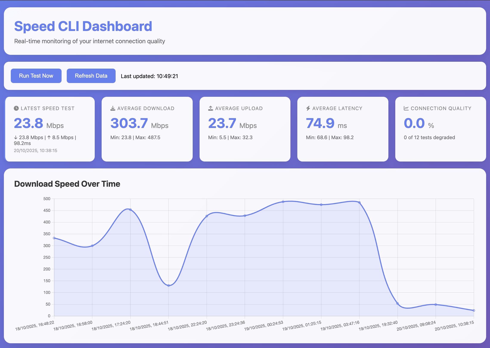

```sh
███████╗██████╗ ███████╗███████╗██████╗                ██████╗██╗     ██╗
██╔════╝██╔══██╗██╔════╝██╔════╝██╔══██╗              ██╔════╝██║     ██║
███████╗██████╔╝█████╗  █████╗  ██║  ██║    █████╗    ██║     ██║     ██║
╚════██║██╔═══╝ ██╔══╝  ██╔══╝  ██║  ██║    ╚════╝    ██║     ██║     ██║
███████║██║     ███████╗███████╗██████╔╝              ╚██████╗███████╗██║
╚══════╝╚═╝     ╚══════╝╚══════╝╚═════╝                ╚═════╝╚══════╝╚═╝
                                                                         
```

> Catch your ISP throttling you! Automatic monitoring with a beautiful web dashboard that runs in the background.

[](https://opensource.org/licenses/MIT)
[](https://github.com/DavidNgugi/speed-cli/releases)
[](https://www.apple.com/macos/)
[](https://www.linux.org/)
[](https://www.microsoft.com/windows/)
[](http://makeapullrequest.com)



## Quick Install

### macOS (Homebrew) - Recommended
```bash
# Add the tap and install
brew tap DavidNgugi/speed-cli
brew install speed-cli

# Configure and start
speed configure
speed start
```

### macOS & Linux (Direct Install)
```bash
curl -fsSL https://raw.githubusercontent.com/DavidNgugi/speed-cli/main/install.sh | bash
```

### Windows (PowerShell)
```powershell
# Run in PowerShell as Administrator
Invoke-WebRequest -Uri "https://raw.githubusercontent.com/DavidNgugi/speed-cli/main/install.sh" -OutFile "install.sh"
bash install.sh
```

That's it! Both monitoring and dashboard are now running in the background.

## Features

- **Automatic hourly monitoring** - Set it and forget it
- **Background web dashboard** - Always available at http://localhost:6432
- **Real-time charts and stats** - Beautiful visualizations
- **Smart alerts** - Get notified when speeds drop
- **Historical data** - Track patterns over weeks
- **CSV exports** - Perfect for ISP support tickets
- **Privacy first** - All data stays on your device
- **No external dependencies** - Uses native platform tools
- **Cross-platform** - Works on macOS, Linux, and Windows

## Quick Start

After installation:
```bash
# Dashboard is already running at http://localhost:6432
# But you can also use these commands:

# Open web dashboard (interactive mode)
speed dashboard

# Manage dashboard service
speed dashboard status  # Check if running
speed dashboard start   # Start in background
speed dashboard stop    # Stop service

# Run a test immediately
speed test

# View your logs
speed logs

# Check monitoring status
speed status

# Check version
speed version
```

Then visit **http://localhost:6432** in your browser!

## What It Does

1. Tests your internet speed every hour using native platform tools
2. Logs download/upload speeds and latency to CSV files
3. Provides a web dashboard to visualize trends
4. Alerts you when speeds drop below your plan's thresholds
5. Helps you build evidence for ISP support tickets

## Configuration

During installation, you'll be asked to configure:

- **Expected speeds** from your ISP (download/upload)
- **Monitoring frequency** (15 minutes to 2 hours)

You can change these settings anytime:

```bash
speed configure
```

This will show your current settings and allow you to update:
- Expected download/upload speeds
- Monitoring interval (how often tests run)
- Performance thresholds for alerts

The system will automatically alert you when speeds drop below 80% of your expected speeds.

## Requirements

### macOS
- macOS Big Sur (11.0) or later
- Python 3 (pre-installed)

### Linux
- Any modern Linux distribution
- `wget` and `bc` (auto-installed if missing)
- `systemd` for background service

### Windows
- Windows 10 or later
- PowerShell 5.1 or later
- Git Bash or WSL (for installation)
- Python 3 (for dashboard)

## Platform-Specific Speed Testing

- **macOS**: Uses native `networkquality` command
- **Linux**: Uses `wget` with speed calculation
- **Windows**: Uses PowerShell with speed calculation

## Windows Setup Instructions

### Prerequisites
1. **Install Git for Windows** (includes Git Bash)
   - Download from: https://git-scm.com/download/win
   - This provides the bash environment needed for installation

2. **Install Python 3**
   - Download from: https://www.python.org/downloads/
   - Make sure to check "Add Python to PATH" during installation

### Installation Steps

1. **Open Git Bash as Administrator**
   ```bash
   # Right-click Git Bash and "Run as administrator"
   ```

2. **Run the installation**
   ```bash
   curl -fsSL https://raw.githubusercontent.com/DavidNgugi/speed-cli/main/install.sh | bash
   ```

3. **Set up background monitoring (Manual)**
   
   Since Windows doesn't have a built-in service manager like macOS/Linux, you'll need to set up a scheduled task:

   **Option A: Using Task Scheduler (Recommended)**
   1. Open "Task Scheduler" (search in Start menu)
   2. Click "Create Basic Task"
   3. Name: "Speed Monitor"
   4. Trigger: "Daily" → "Recur every: 1 days"
   5. Action: "Start a program"
   6. Program: `C:\Program Files\Git\bin\bash.exe`
   7. Arguments: `-c "~/scripts/internet_monitor.sh"`
   8. Check "Run whether user is logged on or not"

   **Option B: Using PowerShell (Alternative)**
   ```powershell
   # Create a scheduled task via PowerShell
   $action = New-ScheduledTaskAction -Execute "C:\Program Files\Git\bin\bash.exe" -Argument "-c '~/scripts/internet_monitor.sh'"
   $trigger = New-ScheduledTaskTrigger -Daily -At 12:00AM
   $settings = New-ScheduledTaskSettingsSet -AllowStartIfOnBatteries -DontStopIfGoingOnBatteries
   Register-ScheduledTask -Action $action -Trigger $trigger -Settings $settings -TaskName "Speed Monitor"
   ```

### Windows Usage

After installation, you can use the CLI commands in Git Bash:

```bash
# Open Git Bash and run:
speed dashboard   # Start web dashboard
speed test        # Run speed test now
speed logs        # View recent logs
speed status      # Check monitoring status
```

### Windows File Locations

```
C:\Users\[YourUsername]\scripts\
├── internet_monitor.sh    # Monitoring script
├── speed_dashboard.py     # Web dashboard server
└── speed                  # CLI tool

C:\Users\[YourUsername]\internet_logs\
├── speed_log_2025-01.csv  # Monthly CSV logs
├── alerts.log             # Performance alerts
└── monitor.log            # Service logs
```

### Windows Troubleshooting

**If installation fails:**
- Make sure you're running Git Bash as Administrator
- Ensure Python 3 is installed and in PATH
- Check that PowerShell is available

**If speed tests fail:**
- Ensure you have an active internet connection
- Check Windows Firewall settings
- Try running `speed test` manually to debug

**If background monitoring doesn't work:**
- Verify the scheduled task is created and enabled
- Check Task Scheduler logs for errors
- Manually run the monitoring script to test

## Usage

### Web Dashboard

Visit `http://localhost:6432` to see:
- Download/upload speed graphs
- Latency trends over time  
- Average, min, max statistics
- One-click manual testing
- Performance degradation tracking

### CLI Commands
```bash
speed dashboard        # Start web dashboard (http://localhost:6432)
speed dashboard start   # Start dashboard as background service
speed dashboard stop    # Stop dashboard service
speed dashboard status  # Check dashboard status
speed test             # Run speed test now
speed logs             # View recent logs
speed alerts           # View performance alerts
speed status           # Check if monitoring is running
speed start            # Start background monitoring
speed stop             # Stop background monitoring
speed configure        # Configure expected speeds and monitoring frequency
speed uninstall        # Remove everything (keeps logs)
```

## Update or Uninstall

### Update to Latest Version
```bash
speed update
```
This downloads the latest scripts and restarts the background monitoring.

### Check Current Version
```bash
speed version
```

### Uninstall
```bash
speed uninstall
```
This removes the tool but preserves your logs in `~/internet_logs/` (or `C:\Users\<You>\internet_logs\` on Windows).

## Configuration

Edit thresholds based on your ISP plan:
```bash
nano ~/scripts/internet_monitor.sh
```

Adjust these values:
```bash
MIN_DOWNLOAD=25   # Minimum download speed (Mbps)
MIN_UPLOAD=5      # Minimum upload speed (Mbps)
MAX_LATENCY=100   # Maximum latency (ms)
```

## File Locations

### macOS & Linux
```
~/scripts/
├── internet_monitor.sh    # Monitoring script
├── speed_dashboard.py     # Web dashboard server
└── speed                  # CLI tool

~/internet_logs/
├── speed_log_2025-01.csv  # Monthly CSV logs
├── alerts.log             # Performance alerts
└── monitor.log            # Service logs

# macOS only
~/Library/LaunchAgents/
└── com.user.internet.monitor.plist  # Background service config

# Linux only
/etc/systemd/system/
└── speed-monitor.service  # Background service config
```

### Windows
```
C:\Users\[YourUsername]\scripts\
├── internet_monitor.sh    # Monitoring script
├── speed_dashboard.py     # Web dashboard server
└── speed                  # CLI tool

C:\Users\[YourUsername]\internet_logs\
├── speed_log_2025-01.csv  # Monthly CSV logs
├── alerts.log             # Performance alerts
└── monitor.log            # Service logs

# Windows Task Scheduler
# Check Task Scheduler for "Speed Monitor" task
```

## Use Cases

- **Catch peak-hour throttling** (evenings, weekends)
- **Document service issues** with timestamped data
- **Verify you're getting what you pay for**
- **Identify patterns** before calling support
- **Build evidence** for switching providers

## Troubleshooting

See [TROUBLESHOOTING.md](docs/TROUBLESHOOTING.md) for common issues.

**Quick checks:**

### macOS
```bash
# Is the service running?
launchctl list | grep internet.monitor

# Check for errors
cat ~/internet_logs/monitor_stderr.log

# Test manually
~/scripts/internet_monitor.sh
```

### Linux
```bash
# Is the service running?
systemctl status speed-monitor.service

# Check for errors
journalctl -u speed-monitor.service

# Test manually
~/scripts/internet_monitor.sh
```

### Windows
```bash
# Check if scheduled task exists
schtasks /query /tn "Speed Monitor"

# Test manually in Git Bash
~/scripts/internet_monitor.sh

# Check logs
cat ~/internet_logs/monitor.log
```

## Contributing

Contributions welcome! Please feel free to submit a Pull Request.

1. Fork the repo
2. Create your feature branch (`git checkout -b feature/AmazingFeature`)
3. Commit your changes (`git commit -m 'Add some AmazingFeature'`)
4. Push to the branch (`git push origin feature/AmazingFeature`)
5. Open a Pull Request

## License

This project is licensed under the MIT License - see the [LICENSE](LICENSE) file for details.

## Show Your Support

If this tool helped you catch your ISP or save money, give it a star!

## Acknowledgments

- Built with native platform tools (`networkquality` on macOS, `wget` on Linux, PowerShell on Windows)
- Inspired by frustrated internet users everywhere
- Made with ❤️ for people tired of paying for slow internet
- Cross-platform support for macOS, Linux, and Windows users

---

**Made by developers, for developers (and anyone tired of slow internet)**

[Report Bug](https://github.com/DavidNgugi/speed-cli/issues) · [Request Feature](https://github.com/DavidNgugi/speed-cli/issues)